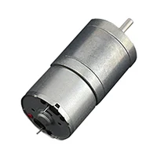
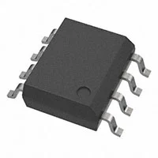
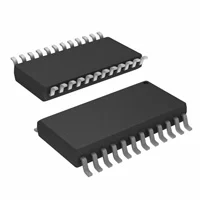
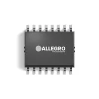

## Module's Selected Major Components

The following sections are the selected major components necessary for the drivetrain subsystem.

<!--
### Actuator

(**remove this note/placeholder**: if applicable, this is where your **Selected** the actuator items go, which includes both the driver and motor. Otherwise, remove this section.)

For more details, review the ["Appendix - Component Selection Process - Actuator"](https://embedded-systems-design.github.io/EGR314DataSheetTemplate/Appendix/01-Componet-Selection/Component-Selection-Process/#actuator) selection.
-->

**Chosen Actuator**:

I will choose ["2. Brushed DC Motor Standard 11605 RPM 5VDC"](https://www.digikey.com/en/products/detail/nmb-technologies-corporation/PAN14EE12AA1/2417070) for this project. This motor adds the least amount of weight which is better for watercraft. Secondarily it operates within the motor driver to ensure successful electrical manipulation. This motor also ensures an easier way to mount the motor which helps prevent catastrophic failure during operations.

**Chosen Actuator Driver**:

I will choose option ["1. IC HALF BRIDGE DRIVER 6A 12DSO](https://www.digikey.com/en/products/detail/infineon-technologies/IFX9201SGAUMA1/5415542) for this project. Due to the knowledge built in the labs and the ability to daisy chain while keeping prices low this option becomes ideal. Furthermore, we are able to meet project requirements with one and if needed bypass it for the other two motors. Creating a backup that might be particularly necessary during a quick project sprint.

### Power Management

**Chosen Voltage Regulator 3.3V Line**:

I will choose option ["4. IC REG BUCK 3.3V 2A TSOT23-6"](https://www.digikey.com/en/products/detail/diodes-incorporated/AP63203WU-7/9858426) for this project. It offers channels that I can use to successfully to get the 3.3v line powered with some extra current to allow for additional features like RC Servos. This will in turn help the project respond in more intuitive ways while providing a decent part with a reduced budget requirement. Furthermore, it does meet project requirements.

**Chosen Voltage Regulator 5V Line**:
I will choose option ["5. IC REG BUCK ADJ 2.5A 20HTSSOP"](https://www.digikey.com/en/products/detail/texas-instruments/LM5005MHX-NOPB/1871800) for this project. It is not ideal to have 2 regulators selected for the project but it does help while reducing costs. This also allows us to meet the project requirements and power budget requirements for my sub module.

## **Components**

**DC Motor**

1. Brushed DC Motor Standard 12850 RPM 12VDC
    

    * $5.22/each
    * [Brushed 12V Digikey](https://www.digikey.com/en/products/detail/nmb-technologies-corporation/PAN14EE12AA1/2417070)
    * [Brushed 12V Datasheet](resources/pdf/Brushed12V.pdf)

    | Pros                                      | Cons                                                             |
    | ----------------------------------------- | ---------------------------------------------------------------- |
    | Edges ensure easy connection point        | Specified for more than motor driver chosen later                |
    | Medium weight                             | Medium to low torque                                             |

2. Brushed DC Motor Standard 11605 RPM 5VDC
    

    * $3.71/each
    * [Standard 5V Digikey](https://www.digikey.com/en/products/detail/nmb-technologies-corporation/PPN7PA12C1/2417079)
    * [Standard 5V Datasheet](resources/pdf/Brushed5V11605.pdf)

    | Pros                                      | Cons                                                             |
    | ----------------------------------------- | ---------------------------------------------------------------- |
    | Light weight (10oz)                       | Medium to low torque                                             |
    | Within driver's operating range           | Long lead time                                                   |
    | Given physical dimensions in datasheet    |                                                                  |

3. GEAR-MOTOR 15 RPM 6V METAL
    

    * $9.90/each
    * [Gear-motor 6V Digikey](https://www.digikey.com/en/products/detail/dfrobot/FIT0495-A/7087178)
    * [Gear-motor 6V Datasheet](resources/pdf/Gearmotor6V.pdf)

    | Pros                                      | Cons                                                             |
    | ----------------------------------------- | ---------------------------------------------------------------- |
    | Largest torque rating                     | Heaviest weight (74g)                                            |
    | Within driver's operating range           | Circle casing makes it more difficult to mount                   |
    | "D" shaped shaft                          |                                                                  |

**Motor Driver**

1. IC HALF BRIDGE DRIVER 6A 12DSO
   

   * $3.55/each
   * [Digikey for IC Half Bridge](https://www.digikey.com/en/products/detail/infineon-technologies/IFX9201SGAUMA1/5415542)
   * [IC Half Bridge Driver 6A PDF](resources/pdf/ICHalfBridgeDriver.pdf)
  
    | Pros                                      | Cons                                                             |
    | ----------------------------------------- | ---------------------------------------------------------------- |
    | Prior Lab Knowledge                       |  Can only be used on one device at a time.                       |
    | Can be Daisy chained on the same line     |  In lab SPI communication hasn't clicked yet                     |
    | Less expensive option                     |  Reduced voltage range                                           |
    | Meets project SPI requirement             |                                                                  |

2. Bipolar Motor Driver Power MOSFET 8-HSOP
   

   * $0.83/each
   * [Digikey for Bipolar 12V](https://www.digikey.com/en/products/detail/toshiba-semiconductor-and-storage/TB67H450AFNG-EL/15995284)
   * [Bipolar 12V pdf](resources/pdf/Bipolar12V.pdf)
  
    | Pros                                      | Cons                                                             |
    | ----------------------------------------- | ---------------------------------------------------------------- |
    | Runs two motors                           | No SPI interface                                                 |
    | Thermal Pad                               | Reduces complexity which hurts project requirements              |
    | Has Thermal shutdown, over current detection and Under voltage lockout |                                     |

3. Motor Driver DMOS Parallel 24-SO
   

   * $6.16/each
   * [Digikey for Motor Driver - 24 SO](https://www.digikey.com/en/products/detail/stmicroelectronics/L6235D013TR/715921)
   * [Motor Driver 24 SO pdf](resources/pdf/MotorDriver2450.pdf)
  
    | Pros                                      | Cons                                                             |
    | ----------------------------------------- | ---------------------------------------------------------------- |
    | Allows for Hall effect sensors            |  No SPI interface on its own                                     |
    | 3 Output channels                         | Extra pins that don't add enough boon to use                     |
    |                                           | Does not meet project Requirements                               |

4. Multiphase Motor Driver PWM, SPI 48-SQFP (7x7)
   

   * $9.25/each
   * [Digikey for Multiphase motor Driver SPI](https://www.digikey.com/en/products/detail/onsemi/LV8968BBUWR2G/10064679)
   * [Multiphase motor Driver SPI](resources/pdf/multiohaseMotorSPI.PDF)

    | Pros                                      | Cons                                                             |
    | ----------------------------------------- | ---------------------------------------------------------------- |
    | Large voltage operating range             | Most expensive part in the selection                             |
    | SPI communication elements                | Larger than other options                                        |
    | Mechanical signals can stop pwm           | Requires special pcb formation to prevent a floating stop        |

**Linear Voltage Regulator**

1. IC REG QUAD BUCK/LINEAR 20TSSOP
    

    * $3.34/each
    * [Digikey Quad Linear](https://www.digikey.com/en/products/detail/allegro-microsystems/A4405KLPTR-T/4915338)
    * [Datasheet](resources/pdf/QuadBuckRegulator.pdf)

    | Pros                                      | Cons                                                             |
    | ----------------------------------------- | ---------------------------------------------------------------- |
    | Offers 3 channels, 2 with outputs we need | Pins would be difficult to Solder                                |
    | Protects against over current             | 6.5mm square device.                                             |
    |                                           | Limited Amperage on outputs                                      |

2. IC REG DL BUCK/LNR 2MHZ 16TSSOP
    

    * $2.87/each
    * [Digikey for Buck/LNR 16TSSOP](https://www.digikey.com/en/products/detail/allegro-microsystems/A4402KLPTR-T/2783710)
    * [Datasheet for Buck/LNR 16TSSOP](resources/pdf/BUCK_LNRRegulator.pdf)

    | Pros                                      | Cons                                                             |
    | ----------------------------------------- | ---------------------------------------------------------------- |
    | 2 channels offering the 2 power levels required | Amperage is limited                                        |
    | Smaller package in a 5mm x6.4mm           |   Could get reset accidentally while powered on                  |
    | Undervoltage lockout and thermal shutdown protection |                                                       |

3. IC REG DL BUCK/LINEAR 16MSOP
    

    * $9.30/each
    * [Digikey for Buck 16MSOP](https://www.digikey.com/en/products/detail/analog-devices-inc/LTC3256EMSE-PBF/6173775)
    * [Datasheet for Buck 16MSOP](resources/pdf/16MSOPBuckRegulator.pdf)

    | Pros                                      | Cons                                                             |
    | ----------------------------------------- | ---------------------------------------------------------------- |
    | Built in current reduction                | Current is reduced below required elements                       |
    | Smallest package                          | Datasheet isn't legible at quick glances                         |
    | Offers thermal protection                 |                                                                  |

4. IC REG BUCK 3.3V 2A TSOT23-6
    

    * $0.71/each
    * [Digikey for Buck 2A](https://www.digikey.com/en/products/detail/diodes-incorporated/AP63203WU-7/9858426)
    * [Datasheet for Buck 2A](resources/pdf/Buck2A.pdf)

    | Pros                                      | Cons                                                             |
    | ----------------------------------------- | ---------------------------------------------------------------- |
    | Handles a 3.3V and 5v line                | Current is below required elements unless its the 3.3v line      |
    | Equations are upfront with diagram in datasheet | Can't be put in sync with another regulator                |

5. IC REG BUCK ADJ 2.5A 20HTSSOP
    

    * $3.77/each
    * [Digikey for Buck ADJ 2.5A](https://www.digikey.com/en/products/detail/texas-instruments/LM5005MHX-NOPB/1871800)
    * [Datasheet for Buck ADJ 2.5A](resources/pdf/Buck2_5A.pdf)

    | Pros                                      | Cons                                                             |
    | ----------------------------------------- | ---------------------------------------------------------------- |
    | Allows for a 5v line                      | Lots of seemingly extra pins                                     |
    | Tolerance allows for 3.3v line            | Medium to high expensive ratio for this grouping                 |
    | Can be synced with other lines through a clock | Typical application diagram is busy                         |

<!-- Not putting the RC servo due it not meeting project requirements but it will be in the power budget. 
https://www.digikey.com/en/products/detail/adafruit-industries-llc/4326/10419470
SERVOMOTOR RC 3-6V W/ 3-PIN JST
4326
https://mm.digikey.com/Volume0/opasdata/d220001/medias/docus/694/4326_Web.pdf
-->
