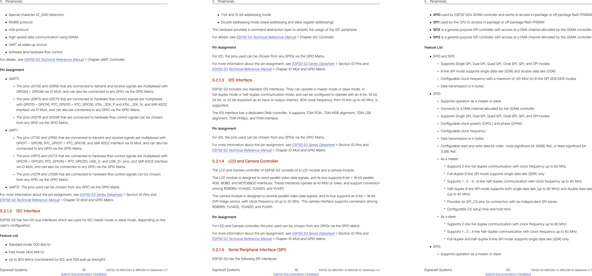

<!--> ESP32 S3 Datasheet URL                        | ?      | Has more detail on functions                                                                              |
| ESP32 S3 Technical Reference Manual URL       | ?      | Has details on I/O multiplexing, USB, and others                                                          | -->
<!--| Code Examples                                 | ?      |  url(s) for libraries on github or other sites related to the microcontroller and your planned peripherals | 
| External Resources URL(s)                     | ?      |  Search on Google and YouTube for other resources for each specific microcontroller.                       | -->

| ESP Info                                      | Answer |
| --------------------------------------------- | ------ |
| Model                                         | ESP32-S3-WROOM-1     |
| Product Page URL                              | [espressif link](https://www.espressif.com/en/module/esp32-s3-wroom-1-en)  |
| ESP32-S3-WROOM-1-N4 Datasheet URL             | [link](https://documentation.espressif.com/esp32-s3-wroom-1_wroom-1u_datasheet_en.pdf)      | 
| Vendor link                                   | [digikey link](https://www.digikey.com/en/products/detail/espressif-systems/ESP32-S3-WROOM-1-N4/16162639) |
| Unit cost                                     | $5.06      |
| Absolute Minimum Current for entire IC        | 1 uA      |
| Supply Voltage Range                          | 3 V min, 3.3V nominal, 3.6V (abs) max |
| Absolute Maximum current   (for entire IC) | 1A      |
| Maximum GPIO current   (per pin)           | 40 mA   |
| Supports External Interrupts?                 | Yes   |
| Required Programming Hardware, Cost, URL      | USB Port or UART?  |

| Module         | # Available | Needed | Associated Pins (or * for any) |
| -------------- | ----------- | ------ | ------------------------------ |
| UART           | 3           | 1      | Any GPIO                       |
| external SPI   | 2           | 1?     | Any GPIO                       |
| I2C            | 2           | 1?     | Any GPIO                       |
| GPIO           |  43         | 0      | ?                              |
| ADC            | 2 SAR ADC - 20 channel | 0      |IO1-IO20             |
| LED PWM        | 8           | 0      | Any GPIO                       |
| Motor PWM      | 2           | 0      | Any GPIO                       |
| USB Programmer | 1           | 1      | USB_D- and USB_D+              |

## **Team Responsibilities**

For this project I am in charge of the drive train, This means that I will need to control 3 DC motors at the minimum and toggle their outputs based on the communication from a teammates board. 

## **Microcontroller Section**

The choice is between a pic or the ESP32-S3-WROOM-1 for a surface mount controller. Most of the team desires to use ESP32 due to experience through personal projects. This alone is not a strong enough reason to use it, but is a good starting point. For this project I'll need at least 1 spi terminal since I can daisy chain the motor controller. I would like an i2c communication port or UART to communicate with other boards. In terms of my full responsibilities, I need to receive information regarding the direction to move the submarine and then communicate that information to the specific motors. Now an important statement to know for not pursuing a pic at this point is that the motor controller was not working during the lab that was using a pic. It didn't work on either of the pics I attempted nor those of my classmates and teammates attempted.

Below are images support this decision and here is the ["Datasheet"](esp32.pdf)

There are enough pins that I can use the UART port as well as the SPI port or I2C port as I see fit while build the rest of the design. There may be a bit of a challenge soldering in the surface mounted pins so I might have to rely on fewer connection points until everything is tested to work and then I can polish the build.
